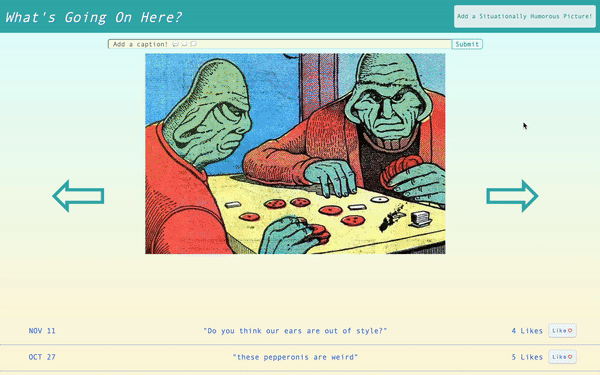
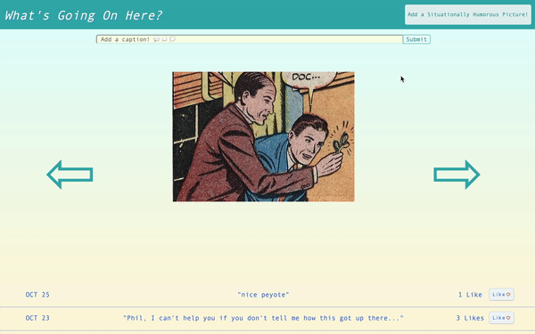

Casual app for browsing or submitting images and adding humorous captions. It is a project 
application done for module 3 of Flatiron School. Besides smoothing up existing features, 
refactoring certain code blocks, and seeking out bugs, the main to-dos are:
  - add custom validation error messages
  - enable caption box scrolling from anywhere in window
  - create thumbnail view of images (stretch goal)
  - enable drag-and-drop image uploading (stretch goal)

## Author
  - Dan Romans | [dangrammer](https://github.com/dangrammer)

## Backend Repository
  - [What's Going On Here? API](https://github.com/dangrammer/whats-going-on-here-backend)

## Languages/Libraries:

  - HTML5
  - CSS3
  - ES6 JavaScript
  
## Live Demo
  Link to walkthrough video with narration:
   
    

## Screenshots

  Flip Through Image Gallery
   
  

  Scroll Through Captions and _Like_ Feature
   
  

  Add Caption
   
  

  Add Image
   
  

  Hidden Link To Author Site
   
  

## How To Install and Run 

  1. install and run [What's Going On Here? backend API](https://github.com/dangrammer/whats-going-on-here-backend)
  2. fork (optional) then clone or download this repository to local machine
  3. use text editor and/or terminal to navigate into `whats-going-on-here-frontend` directory
  4. run `open index.html` in terminal to launch the app in browser

